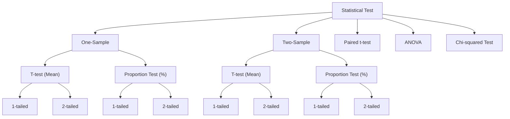

# 📊 Statistics for Data Science — Concepts, Formulas & Worked Examples


Personal notes compiled while studying statistics for data science — covering descriptive and inferential statistics, probability distributions, confidence intervals, and the full family of hypothesis tests, with working Python implementations for the key calculations.

## 📁 Repository Structure

```
statistics/
├── README.md
├── confidence_interval_example.py
├── normal_distribution_probability.py 
└── problem_statement.py
```

## 📑 Table of Contents

1. [Introduction to Statistics](#1-introduction-to-statistics)
2. [Data Types](#2-data-types)
3. [Random Variables and Probability](#3-random-variables-and-probability)
4. [Probability Distributions](#4-probability-distributions)
5. [Worked Example: Normal Distribution Probability](#5-worked-example-normal-distribution-probability)
6. [Central Limit Theorem](#6-central-limit-theorem)
7. [Confidence Intervals](#7-confidence-intervals)
8. [Worked Example: Confidence Interval Calculation](#8-worked-example-confidence-interval-calculation)
9. [Hypothesis Testing](#9-hypothesis-testing)
10. [Case Study: Why Sample Size Matters](#10-case-study-why-sample-size-matters)
11. [Statistical Tests](#11-statistical-tests)
    - [11.1 One-Sample T-test](#111-one-sample-t-test)
    - [11.2 One-Sample Proportion Test](#112-one-sample-proportion-test)
    - [11.3 Two-Sample T-test](#113-two-sample-t-test)
    - [11.4 Two-Sample Proportion Test](#114-two-sample-proportion-test)
    - [11.5 Paired T-test](#115-paired-t-test)
    - [11.6 One-Way ANOVA](#116-one-way-anova)
    - [11.7 Two-Way and Three-Way ANOVA](#117-two-way-and-three-way-anova)
    - [11.8 Formula Reference](#118-formula-reference)
12. [Quick Reference Cheat Sheet](#12-quick-reference-cheat-sheet)
13. [Practice Problems](#13-practice-problems)

---

## 1. Introduction to Statistics

Statistics splits into two broad branches.

**Descriptive Statistics** is used to understand the sample of data you already have. This is where exploratory data analysis (EDA) lives — calculating mean, median, mode, and standard deviation, checking for normal distribution, skewness or kurtosis, and visualizing the data from as many angles as possible.

**Inferential Statistics** is used to make an *estimate* or a statement about an entire population with the help of just a sample of it.

### Why use a sample instead of the whole population?

In theory, you could collect data on every single member of a population and compute statistics directly — a "brute-force" approach. In practice, reaching every individual is expensive, slow, or simply impossible, so a smaller, representative sample is used instead to make inferences about the population.

The general workflow is: take a piece of the data → analyze it → apply inferential statistics methods to it → generalize the result back to the entire population. That generalization step is what makes it *inferential*.

**Divisions of Inferential Statistics**
- Confidence Intervals
- Hypothesis Testing
- Statistical Tests

## 2. Data Types

| Type | Can be segregated? | Has units? | Can be measured? | Examples |
|---|---|---|---|---|
| **Discrete** | No | No | No (counted, not measured) | Number of children, number of goals |
| **Continuous** | Yes | Yes | Yes | Height, weight, time |

**Mapping to pandas data types:**

| Pandas dtype | Statistical type |
|---|---|
| `int64` | Discrete or continuous |
| `float64` | Continuous |
| `object` | Discrete (typically categorical) |

## 3. Random Variables and Probability

A **random variable** is anything whose value can change — with respect to time, circumstance, or observation.

| Random Variable Type | Description | Examples |
|---|---|---|
| **Discrete** | Takes a countable set of values | Goals scored by a team, number of cars someone dreams of owning, age, number of life goals |
| **Continuous** | Can take any value within a range | Height, salary, years of experience |

A **probability distribution** describes how likely each value (or range of values) of a random variable is — it's the tool used to understand and quantify randomness in data.

> **Key idea:** Randomness in the data is the *root* of probability. Without randomness, there is nothing to assign a probability to.

*Example — flipping a coin twice:* the sample space is `X = {HH, HT, TH, TT}`, a simple illustration of a discrete random variable.

## 4. Probability Distributions

Probability distributions split along the same lines as random variables:

| Distribution Type | Used For | Common Example |
|---|---|---|
| **Discrete probability distribution** | Discrete random variables | Binomial distribution (e.g. pass/fail, classification-style outcomes) |
| **Continuous probability distribution** | Continuous random variables | Normal distribution (e.g. payscale, profit, expenses, risk) |

**Why the Standard Normal Distribution specifically?** Standardizing a normal distribution (subtracting the mean and dividing by the standard deviation) reduces its variance to 1. Lower variance generally makes patterns easier to learn — for a human analyst and for a machine learning model alike — which is why standardization is such a common preprocessing step.

## 5. Worked Example: Normal Distribution Probability

**Problem:** The length of a human pregnancy is normally distributed with a mean of 272 days and a standard deviation of 9 days.

1. State the random variable.
2. Find the probability of a pregnancy lasting more than 280 days.
3. Find the probability of a pregnancy lasting less than 250 days.
4. Find the probability that a pregnancy lasts between 265 and 280 days.

**Solution** — see [`code/normal_distribution_probability.py`](code/normal_distribution_probability.py):

```python
from scipy import stats

MEAN, STD_DEV = 272, 9

# 1. Random Variable: Length of a human pregnancy (in days)

# 2. P(X > 280)
p_more_than_280 = 1 - stats.norm.cdf(x=280, loc=MEAN, scale=STD_DEV)

# 3. P(X < 250)
p_less_than_250 = stats.norm.cdf(x=250, loc=MEAN, scale=STD_DEV)

# 4. P(265 < X < 280)
p_between = stats.norm.cdf(x=280, loc=MEAN, scale=STD_DEV) - stats.norm.cdf(x=265, loc=MEAN, scale=STD_DEV)
```

| Question | Result |
|---|---|
| P(X > 280) | 0.1870 |
| P(X < 250) | 0.0073 |
| P(265 < X < 280) | 0.5946 |

## 6. Central Limit Theorem

If multiple samples (S1, S2, S3, …) are drawn from a population and the mean of each sample is computed (m1, m2, m3, …), the *distribution of those sample means* approximates a **Normal Distribution** — regardless of the population's original distribution — as long as each sample is reasonably large.

> **Rule of thumb:** each sample should contain more than 30 observations.

**Why does the CLT matter?** It mainly serves as a verification tool — it's what justifies applying normal-distribution-based methods (t-tests, confidence intervals, etc.) to sample means even when the population's true distribution is unknown.

## 7. Confidence Intervals

- The range of plausible values is called the **interval**.
- The probability associated with that range is called the **confidence**.

> **C.I. is nothing but a range of values associated with a likelihood / probability / confidence level.**

**Plain-language analogy:** instead of claiming "the average height of students is exactly 150 cm," you say "I'm 95% confident the true average height is between 148 cm and 152 cm." That range is the confidence interval — a safe zone where the true value is likely to fall.

## 8. Worked Example: Confidence Interval Calculation

**Scenario:** A small shop records daily ice cream sales over 7 days: `[50, 52, 48, 47, 51, 53, 49]`. Estimate the average daily sales for the whole month using a 95% confidence interval.

**Solution** — see [`code/confidence_interval_example.py`](code/confidence_interval_example.py):

```python
import numpy as np
from scipy import stats

ice_cream_sales = [50, 52, 48, 47, 51, 53, 49]

# Step 1: Mean and standard error
mean_sales = np.mean(ice_cream_sales)
std_dev = np.std(ice_cream_sales, ddof=1)
n = len(ice_cream_sales)
std_error = std_dev / np.sqrt(n)

# Step 2: t-score for 95% confidence
t_score = stats.t.ppf((1 + 0.95) / 2, df=n - 1)

# Step 3: Margin of error
margin_of_error = t_score * std_error

# Step 4: Confidence interval
lower_bound = mean_sales - margin_of_error
upper_bound = mean_sales + margin_of_error
```

**Output:**
```
Average sales: 50.00
95% confidence interval: (48.00, 52.00)
```

## 9. Hypothesis Testing

**Hypothesis testing** is the intermediate analysis performed *before* making a data-driven decision. A hypothesis itself is just an informed intuition that needs to be checked statistically.

- **Null Hypothesis (H₀):** the current process, or "no statistically significant difference."
- **Alternate Hypothesis (Hₐ):** an alternate process, or "yes, statistically significant difference."

A **Statistical Test** is the actual test run to determine whether there's enough evidence to favor the alternate hypothesis over the null.

**Worked example:**

| | |
|---|---|
| **Scenario** | A new 30-day Python bootcamp just finished. Has the average quiz score moved away from the expected passing score of 75? |
| **Business Question** | "Is the average quiz score of our bootcamp students significantly different from the expected score of 75?" |
| **Data Collected** | A random sample of 50 student scores |
| **H₀** | μ = 75 (average score is 75) |
| **Hₐ** | μ ≠ 75 (average score is not 75) |
| **Why this test?** | To validate the bootcamp's effectiveness — a significantly lower average signals a need to revise the course or instructors |

**Two terms that make hypothesis testing concrete:**

- **P-value:** the probability of seeing a result at least as extreme as the one observed, *if the null hypothesis were actually true*. A small p-value means the observed result would be unlikely under H₀.
- **Level of significance (α):** the threshold decided in advance — commonly 5% — that the p-value is compared against. It represents how much risk of wrongly rejecting H₀ is acceptable.

**Decision rule:** if `p-value < α` → reject H₀. If `p-value ≥ α` → do not reject H₀.

## 10. Case Study: Why Sample Size Matters

A short story that captures the intuition behind hypothesis testing, and why a larger sample size leads to a more trustworthy conclusion.

**The challenge.** John, a trainer, believes his new 30-day Python bootcamp can push the average quiz score beyond the long-standing global average of 75. His manager isn't convinced — the existing process already works, so why change it?

**Reality check.** The population of learners runs into the lakhs — far too many to train and test directly. John instead trained 5,000 students using his new method.

**The first shock, and a bias accusation.** A small group randomly picked from those 5,000 students averaged a score of 85 — ten points above the benchmark. The manager is suspicious: maybe John just happened to pick the strongest students.

**The manager takes control.** To rule out bias, the manager picks the sample himself, completely at random — 20 to 30 students. This time the average comes back to exactly 75. "Your method is not special," he says.

**The key insight.** John's explanation: the problem isn't the method, it's the sample size. With very few people in a sample, randomness dominates the result — sometimes it lands on 75, sometimes higher, sometimes lower. To draw a conclusion about the *entire population*, the sample has to be large enough to drown out that randomness.

**The final test.** This time, the manager tests 500 to 1,000 students instead of 20 or 30. The average comes back to 85 again. "This doesn't look like luck anymore," he admits.

**The 95% confidence line.** John is careful not to overclaim — he won't be right every single time. But with enough data, his conclusion will hold roughly 95 times out of 100. The remaining 5% reflects the small, irreducible risk of being wrong purely by chance — exactly what a 5% level of significance represents.

**The decision.** Convinced by the evidence, the manager agrees to reconsider the old assumption — not because John insisted, but because the data supported it.

> **What was the actual question?**
> John was never trying to prove his bootcamp was better *emotionally*. He was answering one precise statistical question: *"Is the average performance of students trained using my new method significantly higher than the existing global average of 75, or is the observed improvement just due to random chance?"*
>
> That single question — signal vs. noise — is the premise behind every hypothesis test in this repository, and it is exactly the question answered by the One-Sample T-test below.

## 11. Statistical Tests

Before reaching for a formula, three quick questions narrow down which test to use:

| Step | Question | Options |
|---|---|---|
| 1 | What are you testing? | Means & averages · Proportions (%) · Categorical counts |
| 2 | How many groups? | 1 group → one-sample test · 2 groups → two-sample test · 3+ groups → ANOVA |
| 3 | One-tailed or two-tailed? | One-tailed: testing for `>` or `<` (one direction) · Two-tailed: testing for `≠` (either direction) |



### 11.1 One-Sample T-test

**Goal:** Compare one sample mean against a known population mean.

| | |
|---|---|
| **Scenario** | A 30-day Python Bootcamp just finished. Check whether the students' average quiz score differs from the expected passing score of 75. |
| **Business Question** | Is the average quiz score significantly different from 75? |
| **Data Collected** | A random sample of 50 student scores |
| **H₀** | μ = 75 |
| **Hₐ** | μ ≠ 75 |

**Why 2-tailed by default?** The result could move significantly higher *or* lower than expected, and at the outset you don't know which direction, so the test stays open to both.

**Converting to a one-tailed test:**
- Left-tailed (Hₐ: μ < 75) — if you suspect performance has dropped
- Right-tailed (Hₐ: μ > 75) — if you suspect performance has improved

**Python implementation — has ticket resolution time increased?**

> A company claims the average time to resolve a customer ticket is 30 minutes. A random sample of 40 tickets shows a mean resolution time of 33 minutes. At the 5% level of significance, has the average resolution time increased?
>
> H₀: μ = 30 (no change) · Hₐ: μ > 30 (increased — right-tailed, since only an *increase* is in question)

See [`code/one_sample_ttest_example.py`](code/one_sample_ttest_example.py):

```python
from scipy import stats
import numpy as np

observations_40_tickets = np.array([
    33, 31, 26, 29, 31, 39, 32, 25, 37, 36, 31, 31, 22, 27, 28, 30, 37,
    41, 28, 30, 37, 30, 30, 34, 31, 31, 22, 35, 44, 31, 37, 36, 27, 38,
    38, 37, 32, 27, 35, 27
])

t_stat, p_value = stats.ttest_1samp(a=observations_40_tickets, popmean=30, alternative="greater")

if p_value < 0.05:
    print("We Reject H0")
else:
    print("We do not reject H0")
```

**Output:**
```
Sample mean: 32.08
t-statistic: 2.6250
p-value: 0.0062
We Reject H0
```

**Conclusion:** At the 5% level of significance, we reject the null hypothesis and conclude that the average ticket resolution time has increased beyond the claimed 30 minutes.

### 11.2 One-Sample Proportion Test

**Goal:** Compare a proportion observed in a sample against a known/benchmark proportion.

| | |
|---|---|
| **Scenario** | 100 students took a Python quiz after an Agentic AI course, and 80 passed. Did the teaching quality push the pass rate above the usual 70% benchmark? |
| **Business Question** | Is the proportion of students who cleared the quiz more than 70%? |
| **Data Collected** | 80 out of 100 students passed |
| **H₀** | p = 0.70 |
| **Hₐ** | p > 0.70 |

**Why one-tailed?** Only an *increase* in performance is of interest here, not a decrease — making it a right-tailed test.

> **Note:** For proportions (like pass rates) with a large sample size, a **Z-test** is used instead of a t-test.

### 11.3 Two-Sample T-test

**Goal:** Compare means between two independent groups.

| | |
|---|---|
| **Scenario** | Compare average final test scores between students who took a course online vs. offline. |
| **Business Question** | Is there a significant difference in average scores between online and offline learners? |
| **Data Collected** | Two groups — 40 online students, 40 offline students |
| **H₀** | μ₁ = μ₂ (both groups have the same average score) |
| **Hₐ** | μ₁ ≠ μ₂ (the averages are different) |
| **Why this test?** | To decide whether to invest more in online infrastructure or in offline delivery |

**Choosing the tail:**
- Left-tailed: μ₁ < μ₂ (suspect the live/offline format is worse)
- Right-tailed: μ₁ > μ₂ (suspect the live/offline format is better)
- Two-tailed: μ₁ ≠ μ₂ (just want to know if they differ)

### 11.4 Two-Sample Proportion Test

**Goal:** Compare proportions between two independent groups.

| | |
|---|---|
| **Scenario** | Two 180-day training batches were run — one with live sessions, one with self-recorded videos plus mentor support. Did the second model improve completion rates? |
| **Business Question** | Is there a difference in completion rates between the two delivery models? |
| **Data Collected** | p₁ (live model) = 30/100 = 0.30; p₂ (self-recorded + mentor) = 70/100 = 0.70 |
| **H₀** | p₁ = p₂ |
| **Hₐ** | p₂ > p₁ |

**Why one-tailed?** Only interested in whether the new model performs *better*, not worse — a right-tailed test.

> **Note:** This is a **Z-test for two proportions**, since two separate groups' proportions are being compared.

### 11.5 Paired T-test

**Goal:** Compare the means of two related (paired) measurements to check for a significant change.

| | |
|---|---|
| **Scenario** | A 45-day course had a pre-assessment on Day 1 and a post-assessment on Day 45. Did scores improve? |
| **Business Question** | Did students improve their scores significantly after the 45-day program? |
| **Data Collected** | 50 students, with a pre-test and post-test score each (difference = Post − Pre) |
| **H₀** | μ_diff = 0 (no improvement) |
| **Hₐ** | μ_diff > 0 (improvement) |
| **Why this test?** | Before-and-after measurements on the *same* group of people are paired data, which is exactly what a paired t-test is built for |

### 11.6 One-Way ANOVA

**Goal:** Compare means across three or more independent groups.

| | |
|---|---|
| **Scenario** | Compare average student ratings (out of 5) across three mentors teaching the same Data Science course |
| **Business Question** | Is there a statistically significant difference in their average scores? |
| **Data Collected** | Student ratings for each mentor |
| **H₀** | μ₁ = μ₂ = μ₃ (all mentors rated the same) |
| **Hₐ** | At least one mean is significantly different |

**Use ANOVA when:** there are 3 or more groups, formats, or strategies to compare. It's called **One-Way** because only one independent variable (mentor) is involved.

### 11.7 Two-Way and Three-Way ANOVA

**Goal:** Compare means across groups influenced by two (or more) independent factors, and check both their individual and combined effects.

| Design | Factors | Goal |
|---|---|---|
| One-Way ANOVA | Mentor | Check if average ratings differ between mentors |
| Two-Way ANOVA | Mentor + Mode | Check if ratings are influenced by mentor, mode, or both |
| Three-Way ANOVA | Mentor + Mode + Course Level | Add a third dimension for deeper insight |

**Scenario:** Student ratings now depend on two factors — mentor (Roshan, Jagadheeshwari, Diya) and delivery mode (Online/Offline). With two factors, there are three business questions to ask:

1. **Mentor effect** — Does the mentor affect ratings?
2. **Mode effect** — Does online/offline affect ratings?
3. **Interaction effect** — Do certain mentors perform better or worse depending on the mode? (e.g. one mentor rated higher offline while another is rated higher online — that's an interaction.)

**Hypotheses in a Two-Way ANOVA:**

| Effect | H₀ | Hₐ |
|---|---|---|
| Main effect of Mentor | All mentors have the same average rating (μ_A = μ_B = μ_C) | At least one mentor's average rating is different |
| Main effect of Mode | Online and offline have the same average rating | There is a difference between online and offline |
| Interaction (Mentor × Mode) | The mode doesn't matter based on the mentor | The effect of mode changes depending on the mentor |

### 11.8 Formula Reference

| Test | Formula | Degrees of Freedom |
|---|---|---|
| Z-test (population SD known) | Z = (x̄ − μ) / (σ / √n) | n |
| One-sample t-test (SD unknown) | t = (x̄ − μ) / (s / √n) | n − 1 |
| Two-sample t-test (SD unknown) | t = (x̄₁ − x̄₂) / (s_p · √(1/n₁ + 1/n₂)) | n₁ + n₂ − 2 |
| Proportion test | Z = (p̂ − p) / √(p(1 − p) / n) | — |
| Chi-squared test | χ² = Σ (O − E)² / E | (r − 1)(c − 1) |

*x̄ = sample mean, μ = population mean, σ = population SD, s = sample SD, s_p = pooled SD, n = sample size, p̂ = sample proportion, p = population proportion, O/E = observed/expected frequency, r/c = rows/columns in a contingency table.*

## 12. Quick Reference Cheat Sheet

| # | Test | Compares | Groups | Typical Use Case |
|---|---|---|---|---|
| 1 | One-Sample T-test | Sample mean vs. a known value | 1 sample | Quiz average vs. expected score |
| 2 | One-Sample Proportion Test | Sample proportion vs. a known value | 1 sample | Pass rate vs. benchmark % |
| 3 | Two-Sample T-test | Means of 2 independent groups | 2 independent | Online vs. offline scores |
| 4 | Two-Sample Proportion Test | Proportions of 2 independent groups | 2 independent | Completion rate across 2 formats |
| 5 | Paired T-test | Means of 2 related/paired measurements | 1 group, before/after | Pre-test vs. post-test scores |
| 6 | One-Way ANOVA | Means across 3+ independent groups | 3+ independent | Ratings across 3+ mentors |
| 7 | Two-/Three-Way ANOVA | Means across groups influenced by 2–3 factors | 3+ independent (factorial) | Mentor × delivery mode ratings |

## 13. Practice Problems

A short self-test. Try identifying the correct test and tail direction for each, then check the hint.

1. The historical average score in a certification exam is 65. A training institute introduces a new course; a random sample of 50 students trained under the new course has an average score of 68. At the 5% level of significance, test whether the new course improves performance.
<details><summary>Test type</summary>One-Sample T-test, right-tailed (H₀: μ = 65, Hₐ: μ > 65)</details>

2. A company claims that the average time taken to resolve customer tickets is 30 minutes. A random sample of 40 tickets shows a mean resolution time of 33 minutes. At the 5% level of significance, test whether the average resolution time has increased.
<details><summary>Test type</summary>One-Sample T-test, right-tailed (H₀: μ = 30, Hₐ: μ > 30) — solved in <a href="code/one_sample_ttest_example.py">code/one_sample_ttest_example.py</a></details>

3. A company claims that 60% of its users are satisfied with its product. In a survey of 200 users, 134 report satisfaction. At the 5% level of significance, test whether customer satisfaction is higher than claimed.
<details><summary>Test type</summary>One-Sample Proportion Test (Z-test), right-tailed (H₀: p = 0.60, Hₐ: p > 0.60)</details>

4. Historically, 40% of applicants pass an entrance test. After a new preparation program, 90 out of 180 applicants pass. Test at the 5% level of significance whether the pass rate has improved.
<details><summary>Test type</summary>One-Sample Proportion Test (Z-test), right-tailed (H₀: p = 0.40, Hₐ: p > 0.40)</details>

5. Two teaching methods are used to train employees — Method A (n = 30) and Method B (n = 28). Test at the 5% level of significance whether there is a difference in average scores between the two methods.
<details><summary>Test type</summary>Two-Sample T-test, two-tailed (H₀: μ_A = μ_B, Hₐ: μ_A ≠ μ_B)</details>

6. The average delivery time from Warehouse A and Warehouse B is compared using random samples from both. At the 5% level of significance, test whether the mean delivery times differ.
<details><summary>Test type</summary>Two-Sample T-test, two-tailed (H₀: μ_A = μ_B, Hₐ: μ_A ≠ μ_B)</details>

7. Two versions of a website are tested. Out of 500 users for Version A, 320 click the signup button; out of 480 users for Version B, 290 click. At the 5% level of significance, test whether the conversion rates differ.
<details><summary>Test type</summary>Two-Sample Proportion Test (Z-test), two-tailed (H₀: p₁ = p₂, Hₐ: p₁ ≠ p₂)</details>

---

### 🛠️ Tools & Libraries
`Python` · `NumPy` · `SciPy (stats)` · `pandas` · `Jupyter Notebook`
